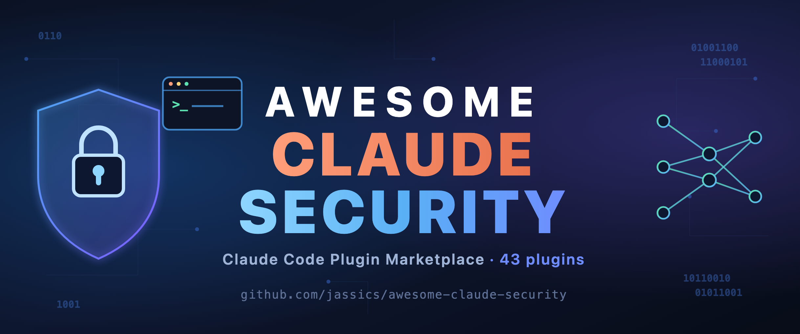

<div align="center">



# awesome-claude-security

**A Claude Code plugin marketplace for the full cybersecurity & GenAI-security lifecycle** — from recon and threat modeling to detection engineering, GRC, and CISO-level strategy.

[](https://github.com/jassics/awesome-claude-security/releases/latest)
[](https://jassics.github.io/awesome-claude-security/)
[](docs/ROADMAP.md)
[](https://docs.anthropic.com/en/docs/claude-code)
[](LICENSE)
[](CONTRIBUTING.md)
[](https://github.com/jassics/awesome-claude-security/stargazers)

[Docs site](https://jassics.github.io/awesome-claude-security/) · [Quick install](#quick-install) · [Getting started](docs/GETTING_STARTED.md) · [What's inside](#whats-inside) · [Taxonomy](docs/TAXONOMY.md) · [Roadmap](docs/ROADMAP.md) · [Recipes](docs/RECIPES.md) · [Contributing](CONTRIBUTING.md)

</div>

A pentester knows which OWASP test bends a broken-access-control endpoint. An analyst knows which Sigma rule catches Kerberoasting. A red-teamer knows which payload coaxes an LLM past its guardrails, and a CISO knows how to turn that finding into board-ready risk. **Your Claude Code doesn't — until you install the plugins that teach it.**

Everything installs **à la carte** — one repo, but you install only the plugins you want, never "the whole thing." Want only LLM red-teaming? Install `llm-security`. Only threat modeling? Install `threat-modeling`.

Prefer a ready-made stack? Install a **bundle** and it auto-pulls its parts: a **role bundle** like `pentester`, or a **domain suite** like `genai-suite`. Granular and bundled both come from the same catalog — see [docs/BUNDLES.md](docs/BUNDLES.md).

> **Stable: [`v1.0.0`](https://github.com/jassics/awesome-claude-security/releases/latest).** The marketplace, taxonomy, templates, and a full first wave of 44 plugins are shipped and installable — see the [roadmap](docs/ROADMAP.md) for what's next. This is a **community** project; it is not affiliated with or endorsed by Anthropic. Contributions welcome — see [CONTRIBUTING](CONTRIBUTING.md).

## Quick install

In any Claude Code session:

```
/plugin marketplace add jassics/awesome-claude-security
/plugin install llm-security@awesome-claude-security
```

Then invoke a skill, e.g. `/llm-security:owasp-llm-top10`, or just describe your task and let Claude pick the right skill/agent. Full instructions: [docs/INSTALL.md](docs/INSTALL.md).

**New here?** [docs/RECIPES.md](docs/RECIPES.md) shows end-to-end workflows — web pentest, incident response, vuln triage, design review, securing a GenAI feature — each chaining the right skills (and role bundles ship a one-shot command, e.g. `/pentester:engagement`).

## What's inside

Plugins are grouped into four buckets (see the full [taxonomy](docs/TAXONOMY.md)):

| Bucket | What it is | Examples |
| --- | --- | --- |
| **Core** | Cross-cutting capabilities every security task reuses | `security-diagramming`, `security-reporting`, integrations (Jira/Confluence/Drive) |
| **Domain** | Deep skillsets per security discipline | `threat-modeling`, web/mobile/cloud/k8s/network/infra security, SAST-SCA, OSINT, DFIR, detection engineering |
| **GenAI security** | Protecting AI/LLM systems from attackers | `llm-security`, RAG security, agentic-AI security, multimodal security |
| **AI safety** | Preventing AI systems from causing harm (a *distinct* discipline — [see why](docs/TAXONOMY.md#ai-security-vs-ai-safety)) | `ai-safety`, `ai-safety-engineer` |
| **Role** | Persona bundles that combine domains + workflow | `pentester`, `ai-safety-engineer`, security analyst, engineer, architect, GRC, blue team, SOC/SIEM, CISO/CTO |

### Shipped today (44 plugins)

**Core**
1. [`security-diagramming`](plugins/security-diagramming/) (attack trees, DFDs, architecture diagrams, mindmaps, infographics)
2. [`security-reporting`](plugins/security-reporting/) (findings, pentest reports, exec summaries, CVSS)
3. [`security-integrations`](plugins/security-integrations/) (publish to Jira/Confluence/Drive)
4. [`security-knowledge`](plugins/security-knowledge/) (ATT&CK / OWASP / framework reference packs).

**Domain** 
1. [`threat-modeling`](plugins/threat-modeling/) (STRIDE/PASTA)
2. [`web-app-security`](plugins/web-app-security/) (OWASP Web Top 10, access control, injection)
3. [`api-security`](plugins/api-security/) (OWASP API Top 10, BOLA/BFLA)
4. [`mobile-security`](plugins/mobile-security/) (MASVS/MASTG)
5. [`sast-sca`](plugins/sast-sca/) (static analysis + dependency/SBOM)
6. [`network-security`](plugins/network-security/) (network pentest, segmentation, protocols)
7. [`osint`](plugins/osint/) (footprinting, exposure discovery, recon)
8. [`cloud-security`](plugins/cloud-security/) (AWS/Azure/GCP posture, IAM, misconfig)
9. [`k8s-security`](plugins/k8s-security/) (CIS/4Cs, RBAC, pod hardening)
10. [`infrastructure-security`](plugins/infrastructure-security/) (IaC review, host hardening, secrets)
11. [`detection-engineering`](plugins/detection-engineering/) (Sigma/YARA, ATT&CK coverage, threat hunting)
12. [`dfir`](plugins/dfir/) (incident response, forensic triage, IOCs)
13. [`threat-intelligence`](plugins/threat-intelligence/) (CTI lifecycle, IOC enrichment, actor profiling)
14. [`vulnerability-management`](plugins/vulnerability-management/) (triage, CVSS/EPSS/KEV prioritization, remediation SLAs)
15. [`supply-chain-security`](plugins/supply-chain-security/) (dependency trust, SLSA/Sigstore provenance, CI/CD integrity)
16. [`claude-config-security`](plugins/claude-config-security/) (audit the Claude Code config itself — hooks/MCP/permissions/skills — via the [`agentscanner`](https://pypi.org/project/agentscanner/) CLI).

**GenAI security**
1. [`llm-security`](plugins/llm-security/) (OWASP LLM Top 10, prompt injection)
2. [`rag-security`](plugins/rag-security/) (retrieval poisoning, isolation)
3. [`agentic-ai-security`](plugins/agentic-ai-security/) (tool-permission audit, autonomy boundaries, MCP/agent-harness/A2A security)
4. [`multimodal-security`](plugins/multimodal-security/) (cross-modal injection)
5. [`mlops-security`](plugins/mlops-security/) (ML supply chain, pipeline security, model serving).

**AI safety** *(≠ security — [see why](docs/TAXONOMY.md#ai-security-vs-ai-safety))*
1. [`ai-safety`](plugins/ai-safety/) (harm modeling, safety evals, responsible red-team, bias/fairness, guardrails, RAI governance).

**Roles** *(auto-install their stack)*
1. [`pentester`](plugins/pentester/)
2. [`red-team`](plugins/red-team/) (adversary emulation, ATT&CK)
3. [`blue-team`](plugins/blue-team/) (threat-informed defense + purple teaming)
4. [`soc-siem`](plugins/soc-siem/) (alert triage, monitoring)
5. [`security-analyst`](plugins/security-analyst/) (investigation & analysis, T2/T3)
6. [`security-architect`](plugins/security-architect/) (secure-by-design, design review)
7. [`security-engineer`](plugins/security-engineer/) (DevSecOps, harden, secure pipelines)
8. [`ai-safety-engineer`](plugins/ai-safety-engineer/)
9. [`responsible-ai-officer`](plugins/responsible-ai-officer/) (AI governance, EU AI Act risk-tiering).
10. [`grc`][plugins/grc]
11. [`developer`](plugins/developer/) (secure-by-default coding companion, PRD/prompt security injection, pre-commit gate).

**Executive** *(strategic tier)*
1. [`ciso-toolkit`](plugins/ciso-toolkit/) (security strategy, cyber-risk quantification, board decks)
2. [`cto-security`](plugins/cto-security/) (secure-by-design at scale, tech-risk assessment).

**Suites** *(one-shot bundles)*
1. [`genai-suite`](plugins/genai-suite/) (all GenAI security)
2. [`appsec-suite`](plugins/appsec-suite/) (web+api+mobile+SAST/SCA)
3. [`cloud-suite`](plugins/cloud-suite/) (cloud+k8s+infrastructure)
4. [`blueops-suite`](plugins/blueops-suite/) (detection+dfir+threat-intel)
5. [`ai-safety-suite`](plugins/ai-safety-suite/) (safety + GenAI security together).

The [roadmap](docs/ROADMAP.md) is fully shipped — see it for how the buckets fit together and where the project goes next.

> **Security vs. safety:** the GenAI plugins protect AI systems from *attackers*; `ai-safety` prevents AI systems from *causing harm* even absent an attacker. They're complementary — most AI features need both.

## Built-in capabilities

Several features are designed to be shared across every plugin:

- **Diagrams & visuals** — Excalidraw diagrams, mindmaps, attack trees, and infographics via `security-diagramming`.
- **Reporting** — repeatable report generation via `security-reporting`, from a single finding to a board deck.
- **Integrations** — push findings, reports, and diagrams to Jira, Confluence, and Google Drive (roadmap: `security-integrations`, leveraging the matching MCP servers).

## Repository layout

```
.
├── .claude-plugin/marketplace.json   # the marketplace catalog
├── plugins/<plugin-name>/            # one installable plugin per directory
│   ├── .claude-plugin/plugin.json
│   ├── skills/<skill>/SKILL.md
│   ├── agents/<agent>.md
│   └── README.md
├── templates/                        # copy-to-start scaffolds for new plugins
└── docs/                             # taxonomy, roadmap, install, authoring guides
```

## Contributing

This is meant to be a community resource. New domains, roles, skills, and agents are very welcome — start from [templates/](templates/) and read [CONTRIBUTING.md](CONTRIBUTING.md) and [docs/AUTHORING.md](docs/AUTHORING.md).

## Scope & ethics

These assets are for **authorized** security testing, defensive security, detection, GRC, education, and CTF use. Skills assume you have permission to test the systems involved. See [CONTRIBUTING.md](CONTRIBUTING.md#scope--ethics).

## License

[GPL-3.0](LICENSE).
