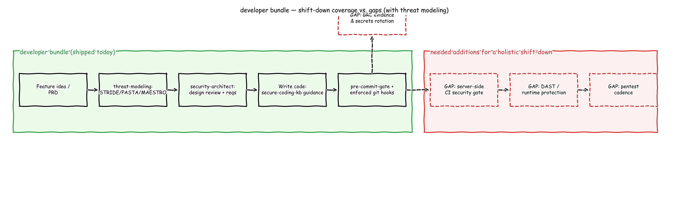
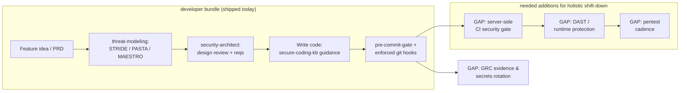

# `developer` Bundle — Shift-Left/Shift-Down One-Pager

## Problem Statement
Developers — especially in AI-assisted/"vibe coding" workflows — ship code fast without security context. There are ~45 security plugins in this marketplace; a developer doesn't know which to reach for, so security gets deferred to a pentest/audit weeks or months later: expensive, adversarial, and too late to change design cheaply.

## What It Solves
- **Single entry point.** The `developer` agent orchestrates security across the feature lifecycle — no need to know which of the ~45 plugins applies.
- **Threat modeling at design time.** `threat-modeling` (STRIDE/PASTA/MAESTRO + risk-rank) is now an auto-installed dependency — data-flow and attack-surface analysis before code is written, not just requirements text.
- **Security requirements at design time.** Injects security asks into PRDs/prompts and runs architecture design review (via `security-architect`).
- **In-flow secure-coding guidance.** Flags banned/vulnerable functions and hardcoded secrets while coding, backed by `security-knowledge:secure-coding-kb`'s good-vs-bad pattern tables.
- **Enforced, not advisory, at commit/push.** `secure-coding`'s real git hooks block a commit/push containing a secret or banned function — works even outside a Claude Code session.
- **Diff-scoped breadth.** `/developer:precommit` aggregates secrets, SAST, SCA, and IaC checks on just the changeset into one pass/fail verdict — fast enough to run every commit.

## What It Won't Solve (gaps for a holistic shift-down)
| Gap | Why the bundle stops here | Add |
|---|---|---|
| Server-side CI enforcement | Hooks are local — `--no-verify`, a clone without hooks installed, or a bypassed workstation skips them | CI pipeline gate mirroring pre-commit, enforced via branch protection |
| Runtime/production security | No DAST, WAF, or runtime protection | DAST tooling + `infrastructure-security` runtime controls |
| Adversarial pentest | Diff-scoped review + design-time threat modeling can't fully replace live exploitation testing | `pentester` role, periodic human red-team |
| Secrets lifecycle | Detects hardcoded secrets; doesn't vault or rotate them | `secrets-management-review` + a real secrets manager (Vault/KMS) |
| Continuous dependency/cloud posture | SCA/IaC checks are point-in-time at commit | Continuous SCA (Dependabot/Snyk) + CSPM |
| Compliance evidence | No audit trail or policy sign-off | `grc` plugin + org process |
| Security culture | Tooling nudges ≠ developer security literacy | Metrics-driven training loop (findings-per-dev trend) |

## Pros
- Low friction — one agent, sane defaults, no plugin-picking required.
- Threat modeling and architecture review now sit ahead of coding, not just secrets/SAST after the fact.
- Enforcement (git hooks), not just advice — hardest-to-skip control in the stack.
- Composable — built on standalone plugins with no duplicated logic; each can be used independently too.
- Fast feedback loop — seconds/minutes instead of weeks.

## Cons
- Local-only enforcement is bypassable (hooks not installed, removed, or pushed from another machine).
- No coverage of runtime-level flaws or live exploitation — risks a false sense of completeness ("we have the developer bundle, we're covered").
- Threat modeling is a manual step (run it explicitly for a new feature/PRD) — nothing forces it to run before the first commit.
- Manual one-time setup per repo (`install-git-hooks.sh`) — no org-wide auto-provisioning yet.
- Depends on the developer actually running the gate/having hooks installed — nothing forces adoption centrally until CI enforcement is added.

## Diagram
Excalidraw sketch-style flow — green boxes = what `developer` ships today (now including threat modeling), red dashed boxes = gaps to close for a holistic shift-down program. Import at [excalidraw.com](https://excalidraw.com) → *Open* → `docs/developer-bundle-shift-down.excalidraw`, or view the rendered PNG below.

